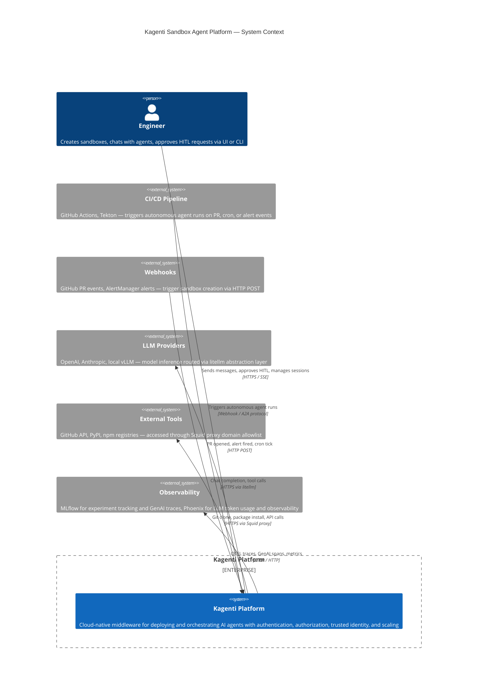
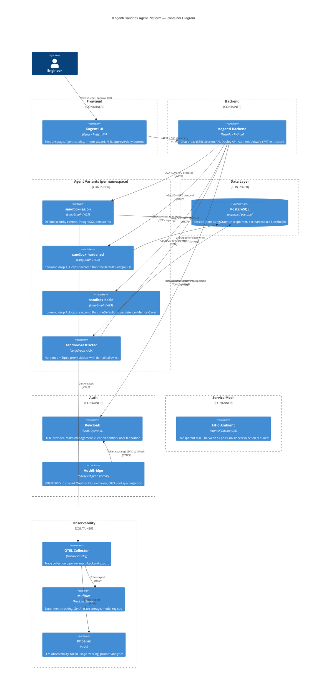
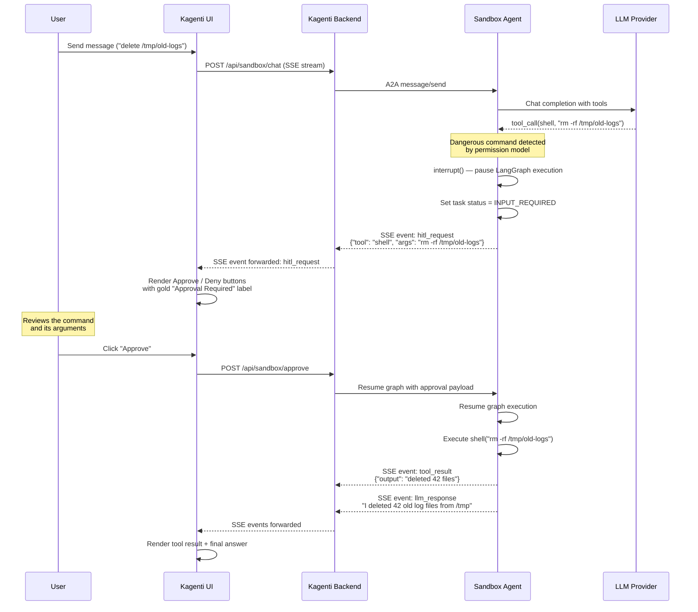
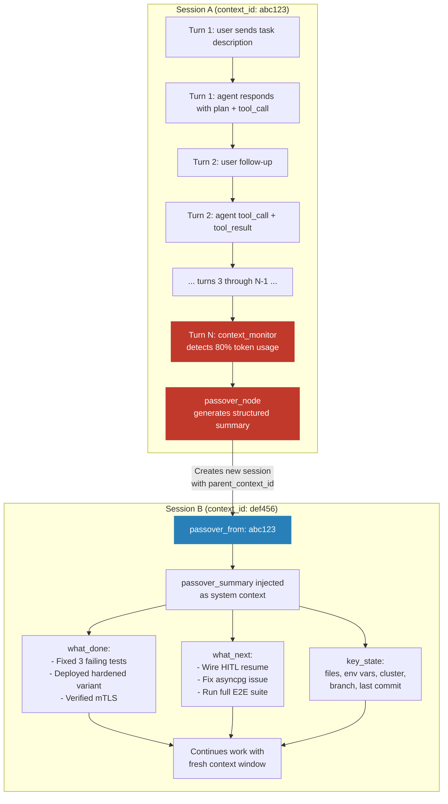

# Sandbox Agent Platform — System Design

> **Status:** Active Development
> **Date:** 2026-03-01
> **PR:** #758 (feat/sandbox-agent)
> **Clusters:** sbox (dev), sbox1 (staging), sbox42 (integration test)

---

## Table of Contents

1. [System Context (C4 Level 1)](#1-system-context-c4-level-1)
2. [Container Diagram (C4 Level 2)](#2-container-diagram-c4-level-2)
3. [HITL Sequence Diagram](#3-hitl-sequence-diagram)
4. [Session Continuity Diagram](#4-session-continuity-diagram)
5. [Defense-in-Depth Layers](#5-defense-in-depth-layers)
6. [What's Built vs What's Left](#6-whats-built-vs-whats-left)
7. [Test Coverage](#7-test-coverage)

---

## 1. System Context (C4 Level 1)

The system context shows Kagenti as a middleware platform connecting engineers, CI/CD pipelines, and webhook triggers to LLM providers, external tools, and observability backends.

**Status: Built** ✅



---

## 2. Container Diagram (C4 Level 2)

The container diagram shows the internal architecture of the Kagenti platform, organized by functional boundary: frontend, backend, agent variants, data layer, auth, service mesh, and observability.



### Component Status

| Component | Description | Status |
|-----------|-------------|--------|
| **UI** — Sessions page | Multi-turn chat, session list, session switching, localStorage persistence | ✅ Built |
| **UI** — Agent catalog | Agent selector panel with variant badges, click-to-switch | ✅ Built |
| **UI** — Import wizard | Security contexts, credential handling, manifest generation | ✅ Built |
| **UI** — HITL buttons | Approve/Deny buttons rendered in chat via ToolCallStep component | 🔧 Partial (buttons exist, resume not wired) |
| **Backend** — Chat proxy | SSE streaming, JSON-first event parsing, regex fallback for legacy format | ✅ Built |
| **Backend** — Session API | History aggregation across A2A task records, artifact deduplication, identity labels | ✅ Built |
| **Backend** — Deploy API | Wizard deploy endpoint with SecurityContext generation | 🔧 Partial (no Shipwright build trigger) |
| **Backend** — Auth middleware | Keycloak JWT extraction, per-message username injection | 🔧 Partial (deployed, needs DB connection fix) |
| **sandbox-legion** | Default agent with PostgreSQL checkpointer | ✅ Built |
| **sandbox-hardened** | non-root, drop ALL caps, seccomp RuntimeDefault, PostgreSQL | ✅ Built |
| **sandbox-basic** | Hardened security, MemorySaver (no persistence) | ✅ Built |
| **sandbox-restricted** | Hardened + Squid proxy sidecar with domain allowlist | ✅ Built |
| **PostgreSQL** | Per-namespace StatefulSet, LangGraph checkpointer | 🔧 Partial (Istio ztunnel corrupts asyncpg connections) |
| **Keycloak** | OIDC provider with RHBK operator | ✅ Built |
| **AuthBridge** | SPIFFE-to-OAuth token exchange, OTEL root span injection | ✅ Built |
| **Istio Ambient** | ztunnel-based mTLS, no sidecar injection | ✅ Built |
| **OTEL Collector** | Trace collection and multi-backend export pipeline | ✅ Built |
| **MLflow** | Experiment tracking and GenAI trace storage | ✅ Built |
| **Phoenix** | LLM observability and token usage analytics | ✅ Built |

---

## 3. HITL Sequence Diagram

Human-in-the-loop (HITL) approval flow for dangerous tool calls. The agent uses LangGraph's `interrupt()` to pause graph execution and emit an `hitl_request` event via SSE. The UI renders approve/deny buttons. On approval, the backend forwards the decision to the agent, which resumes execution.

**Status:** 🔧 Partial (buttons exist, resume not wired)



### What Works Today

| Aspect | Status |
|--------|--------|
| Agent detects dangerous commands and calls `interrupt()` | ✅ Working |
| Backend receives `INPUT_REQUIRED` status from A2A response | ✅ Working |
| UI renders `hitl_request` events with Approve/Deny buttons | ✅ Working |
| Auto-approve for safe tools (`get_weather`, `search`, `get_time`, `list_items`) | ✅ Working |
| Playwright test verifies HITL card rendering (mocked SSE) | ✅ Passing |

### What's Missing

| Gap | Description |
|-----|-------------|
| Resume endpoint | `POST /api/sandbox/approve` is stubbed — needs to forward approval to the agent's `graph.astream()` with the resume payload |
| Deny flow | Deny button exists but does not cancel the pending graph execution |
| Timeout | No TTL on pending HITL requests — agent waits indefinitely for human response |
| Multi-channel delivery | Design exists for Slack, GitHub PR comments, PagerDuty adapters — none implemented |

---

## 4. Session Continuity Diagram

Automated session passover handles context window exhaustion. When the agent's token usage approaches the model's context limit, a `context_monitor` node triggers a `passover_node` that summarizes the session state and creates a new child session to continue the work with a fresh context window.

**Status:** ❌ Not built (design doc at `docs/plans/2026-02-27-session-orchestration-design.md`)



### Passover Data Model

```json
{
  "context_id": "def456",
  "passover_from": "abc123",
  "passover_summary": {
    "what_done": [
      "Fixed 3 failing tests in test_sandbox.py",
      "Deployed sandbox-hardened variant to team1 namespace",
      "Verified mTLS between agent and backend pods"
    ],
    "what_next": [
      "Wire HITL resume endpoint",
      "Fix asyncpg + Istio ztunnel incompatibility",
      "Run full E2E suite on sbox1 cluster"
    ],
    "key_state": {
      "files_modified": ["sandbox.py", "SandboxPage.tsx"],
      "env_vars": {"KUBECONFIG": "~/clusters/hcp/kagenti-team-sbox/auth/kubeconfig"},
      "cluster": "kagenti-team-sbox",
      "branch": "feat/sandbox-agent",
      "last_commit": "a1b2c3d"
    }
  }
}
```

### Design Decisions

| Decision | Rationale |
|----------|-----------|
| Trigger on token count, not turn count | Turn-based triggers miss sessions with few long turns (e.g., large tool outputs) |
| Summary via dedicated LLM call with structured output | Ensures consistent summary format regardless of conversation style |
| `passover_from` field creates linked chain | Enables UI to reconstruct full session history across passover boundaries |
| Requires sub-agent delegation mechanism | Session B is a new A2A task — the passover creates a SandboxClaim |
| UI renders passover notice in chat | User sees "Session continued in Session B" with link to follow |

---

## 5. Defense-in-Depth Layers

The sandbox agent platform uses 7 independent security layers. Compromising one layer does not bypass the others. Each layer addresses a different threat vector.

| Layer | Mechanism | Threat Mitigated | Status |
|-------|-----------|-----------------|--------|
| 1 | **Keycloak OIDC** | Unauthenticated access — only users with valid JWT can reach the platform | ✅ Built |
| 2 | **RBAC** (admin / operator / viewer) | Unauthorized actions — role-based access to namespaces, agents, and sessions | ✅ Built |
| 3 | **Istio Ambient mTLS** | Network eavesdropping — all pod-to-pod traffic encrypted via ztunnel, no plaintext on the wire | ✅ Built |
| 4 | **SecurityContext** (non-root, drop caps, seccomp) | Privilege escalation — prevents container breakout, restricts syscalls, enforces read-only rootfs | ✅ Built (hardened variant) |
| 5 | **Network Policy + Squid Proxy** | Data exfiltration — allowlist of permitted external domains (GitHub, PyPI, LLM APIs); all other egress blocked | 🔧 Partial (Squid proxy designed and tested, not deployed to all variants) |
| 6 | **Landlock** (nono binary) | Filesystem escape — kernel-enforced restrictions on which paths the agent process can read/write (e.g., allow /workspace, deny /etc) | 🔧 Partial (nono binary exists and tested, not integrated into agent startup) |
| 7 | **HITL Approval Gates** | Destructive actions — dangerous tool calls require explicit human approval before execution | 🔧 Partial (buttons exist, resume not wired) |

### Security Variant Matrix

Each agent variant enables a different combination of security layers, allowing teams to choose the appropriate level of isolation for their workload:

| Variant | L1 Keycloak | L2 RBAC | L3 mTLS | L4 SecCtx | L5 Proxy | L6 Landlock | L7 HITL |
|---------|:-----------:|:-------:|:-------:|:---------:|:--------:|:-----------:|:-------:|
| sandbox-legion | ✅ | ✅ | ✅ | -- | -- | -- | ✅ |
| sandbox-hardened | ✅ | ✅ | ✅ | ✅ | -- | -- | ✅ |
| sandbox-basic | ✅ | ✅ | ✅ | ✅ | -- | -- | ✅ |
| sandbox-restricted | ✅ | ✅ | ✅ | ✅ | ✅ | -- | ✅ |

### Future Runtime Isolation

| Runtime | Status | Notes |
|---------|--------|-------|
| **gVisor (runsc)** | Blocked | Intercepts all syscalls in user-space. Incompatible with OpenShift SELinux — gVisor rejects all SELinux labels but CRI-O always applies them. Deferred until wrapper script or upstream fix available. |
| **Kata Containers** | Planned (later) | VM-level isolation (each pod = lightweight VM with own kernel). Requires `/dev/kvm` on nodes. Strongest isolation but highest overhead (~128MB per pod, 100-500ms boot). Red Hat's officially supported sandbox runtime. |

---

## 6. What's Built vs What's Left

### Built (✅)

| Feature | Evidence / Detail |
|---------|-------------------|
| Multi-turn chat with tool calls | 12/12 Playwright tests passing across session isolation, variant switching, and identity suites |
| 4 agent security variants deployed and tested | sandbox-legion, sandbox-hardened, sandbox-basic, sandbox-restricted — all running on sbox cluster, each with distinct SecurityContext |
| Session isolation, persistence, identity labels | 5 Playwright tests verify no state leak between sessions, localStorage persistence across page reload |
| Agent selector UI | SandboxAgentsPanel shows active session's agent (filtered view), click to switch agents for new sessions |
| HITL event display | hitl_request events rendered as approval cards with Approve/Deny buttons and gold "Approval Required" label |
| History aggregation across A2A task records | Backend aggregates message history from multiple A2A task records within a single session |
| SSE reconnect with backoff | Frontend reconnects on disconnect with exponential backoff; prevents UI freeze on transient network failures |
| Wizard with security contexts + credential handling | Import wizard generates deployment manifests with SecurityContext, secret references, and namespace targeting |
| Session orchestration design | 685-line design doc covering passover chains, delegation, and graph visualization |
| JSON-first event serializer | LangGraphSerializer emits structured JSON events; backend parses JSON first with regex fallback for legacy sessions |
| Route timeout 120s | Both kagenti-api and kagenti-ui OpenShift routes configured with 120s annotation |
| CI pipeline passing | Build (3.11/3.12), DCO, Helm Lint, Bandit, Shell Lint, YAML Lint, Trivy — all passing on PR #758 |

### Critical Blockers (🚨)

| Blocker | Impact | Root Cause | Attempted Fixes | Workaround |
|---------|--------|------------|-----------------|------------|
| **Istio ambient ztunnel corrupts asyncpg PostgreSQL connections** | Agent cannot persist sessions to PostgreSQL; SSE streams break with "Connection error" in UI | ztunnel's mTLS insertion corrupts asyncpg's binary protocol handshake mid-operation | `PeerAuthentication: PERMISSIVE`, `ambient.istio.io/redirection: disabled` annotation, `ssl=False` parameter, direct pod IP | Use MemorySaver (in-memory, no cross-restart persistence) or disable mesh for postgres pod |
| **Agent serializer not included in container image** | Tool call events not structured during live streaming from rebuilt images; ToolCallStep component receives unparseable data | `event_serializer.py` exists in git but `uv sync` in Dockerfile does not install it | None — packaging issue in pyproject.toml | ConfigMap mount of both `event_serializer.py` and `agent.py` into running pods |

### Partial (🔧)

| Feature | What Works | What's Missing |
|---------|-----------|----------------|
| Tool call rendering during live streaming | JSON event parsing in backend, ToolCallStep component renders 6 event types | Agent image rebuild needed with serializer included (not just ConfigMap workaround) |
| HITL approve/deny | Buttons rendered, callbacks defined, auto-approve for safe tools | Resume endpoint stubbed — needs to forward approval to `graph.astream()` with resume payload |
| Wizard deploy | UI wizard generates manifest with security contexts and credentials | No Shipwright build trigger — wizard creates manifest but does not start container build |
| Multi-user per-message identity | Code deployed to backend (JWT extraction) and frontend (username labels) | Blocked by asyncpg DB connection failure (Istio ztunnel); cannot persist identity metadata |
| Squid proxy network filtering | Proxy built and tested (GitHub/PyPI allowed, evil.com blocked) | Only deployed to sandbox-restricted variant; not integrated into other agent variants |
| Landlock filesystem sandbox | nono binary compiled, tested (blocks /etc/shadow, allows /workspace) | Not integrated into agent container startup sequence; requires nono-launcher.py wiring |

### Not Built (❌)

| Feature | Design Status | Dependency |
|---------|--------------|------------|
| Sub-agent delegation | `delegate` tool placeholder exists; in-process (LangGraph asyncio) and out-of-process (A2A SandboxClaim) approaches designed | SandboxClaim CRD + controller for spawning child pods |
| Automated session passover | Design complete (session orchestration doc) | Sub-agent delegation (Session B is a new A2A task) |
| Session graph visualization | Not designed | Session passover (needs chain data to visualize) |
| External DB URL wiring | Not designed | Istio ztunnel fix (once asyncpg works, external DB is straightforward) |
| Workspace cleanup / TTL | SandboxClaim has `shutdownTime` + `Delete` policy fields | No cleanup controller; expired sandboxes are not reaped |
| Multi-channel HITL delivery | Designed: GitHub PR comments, Slack interactive messages, PagerDuty, Kagenti UI adapters | HITL resume endpoint must work first (Layer 7) |
| Autonomous triggers (cron / webhook / alert) | Designed: SandboxTrigger module, FastAPI endpoint, Integration CRD | SandboxClaim CRD + controller |
| TOFU hash verification | Logic tested (SHA-256 of CLAUDE.md, detects tampering, ConfigMap storage) | Not integrated into sandbox init container flow |

---

## 7. Test Coverage

### Playwright Tests (UI E2E)

| Suite | Spec File | Tests | Status |
|-------|-----------|:-----:|--------|
| Session isolation | `sandbox-sessions.spec.ts` | 5 | ✅ 5/5 passing |
| Agent variants | `sandbox-variants.spec.ts` | 4 | ✅ 4/4 passing |
| Identity + HITL | `sandbox-chat-identity.spec.ts` | 3 | ✅ 3/3 passing |
| Tool call rendering | `sandbox-rendering.spec.ts` | 4 | ❌ 0/4 (blocked by agent DB connection) |

**Playwright total: 12/16 passing**

### Backend E2E (pytest)

| Suite | Test | Status |
|-------|------|--------|
| Agent card discovery | `test_sandbox_agent::test_agent_card` | ✅ passing |
| Shell execution | `test_sandbox_agent::test_shell_ls` | ✅ passing |
| File write/read | `test_sandbox_agent::test_file_write_and_read` | ✅ passing |
| Multi-turn file persistence | `test_sandbox_agent::test_multi_turn_file_persistence` | ✅ passing |
| Multi-turn memory (Bob Beep) | `test_sandbox_agent::test_multi_turn_memory` | ✅ passing |
| Platform health, Keycloak, MLflow, Phoenix, Shipwright | `test_*.py` (16+ tests) | Not run (require in-cluster access) |

### Session Ownership Tests

| Test | Status |
|------|--------|
| Username on AgentChat page | ✅ passing |
| Username on SandboxPage | ✅ passing |
| Session ownership table columns (4 tests) | ✅ passing |
| Sandbox chat identity + session switching (3 tests) | ✅ passing |

### CI Pipeline (PR #758)

| Check | Status |
|-------|--------|
| Build (Python 3.11) | ✅ passing |
| Build (Python 3.12) | ✅ passing |
| DCO sign-off | ✅ passing |
| Helm Lint | ✅ passing |
| Bandit (security scanner) | ✅ passing |
| Shell Lint (shellcheck) | ✅ passing |
| YAML Lint | ✅ passing |
| Trivy (container vulnerability scan) | ✅ passing |
| Deploy & Test (Kind) | ✅ passing (sandbox tests skipped via marker) |
| CodeQL (code analysis) | Pre-existing baseline issue |
| E2E HyperShift | Pending (`/run-e2e` comment trigger) |

---

## Appendix A: Cluster Inventory

| Cluster | Purpose | Kubeconfig | Status |
|---------|---------|------------|--------|
| `kagenti-team-sbox` | Development — all 4 agent variants deployed, primary test target | `~/clusters/hcp/kagenti-team-sbox/auth/kubeconfig` | Active |
| `kagenti-team-sbox1` | Staging — platform deployed, needs agent redeploy | `~/clusters/hcp/kagenti-team-sbox1/auth/kubeconfig` | Active (kubeconfig may need refresh) |
| `kagenti-hypershift-custom-lpvc` | Integration test — original POC cluster | `~/clusters/hcp/kagenti-hypershift-custom-lpvc/auth/kubeconfig` | Active |

## Appendix B: Key File Locations

```
kagenti/kagenti/
├── kagenti/
│   ├── ui-v2/
│   │   ├── src/pages/SandboxPage.tsx                # Main sandbox chat page
│   │   ├── src/components/SandboxAgentsPanel.tsx     # Agent selector sidebar
│   │   └── e2e/
│   │       ├── sandbox-sessions.spec.ts             # Session isolation tests (5)
│   │       ├── sandbox-variants.spec.ts             # Agent variant tests (4)
│   │       ├── sandbox-chat-identity.spec.ts        # Identity + HITL tests (3)
│   │       └── sandbox-rendering.spec.ts            # Tool call rendering tests (4)
│   ├── backend/
│   │   ├── routers/sandbox.py                       # Chat proxy, session API, HITL stubs
│   │   ├── routers/sandbox_deploy.py                # Wizard deploy endpoint
│   │   └── services/kubernetes.py                   # K8s operations for deploy
│   └── tests/e2e/common/test_sandbox_agent.py       # Backend E2E tests (5)
├── charts/kagenti/                                  # Helm chart (agent namespace templates)
├── deployments/sandbox/                             # Security modules and templates
│   ├── sandbox-template-full.yaml                   # Full SandboxTemplate (init + litellm)
│   ├── proxy/{Dockerfile,squid.conf,entrypoint.sh}  # Squid proxy sidecar
│   ├── skills_loader.py                             # CLAUDE.md + .claude/skills/ parser
│   ├── nono-launcher.py                             # Landlock filesystem sandbox wrapper
│   ├── repo_manager.py                              # sources.json remote enforcement
│   ├── tofu.py                                      # Trust-on-first-use hash verification
│   ├── triggers.py                                  # Autonomous trigger module (cron/webhook/alert)
│   └── hitl.py                                      # Multi-channel HITL delivery adapters
├── .github/scripts/
│   ├── kagenti-operator/35-deploy-agent-sandbox.sh  # Controller deployment script
│   └── local-setup/hypershift-full-test.sh          # Full pipeline (Phase 2.5 agent sandbox)
└── docs/plans/
    ├── 2026-02-23-sandbox-agent-research.md         # Research doc (7 projects, 18 capabilities)
    ├── 2026-02-24-sandbox-agent-implementation-passover.md
    ├── 2026-02-25-sandbox-agent-passover.md
    ├── 2026-02-27-sandbox-session-passover.md
    ├── 2026-02-27-session-orchestration-design.md   # Session passover + delegation design (685 lines)
    ├── 2026-02-27-session-ownership-design.md       # Multi-user session ownership
    ├── 2026-02-28-sandbox-session-passover.md       # Final passover with sub-plans
    └── 2026-03-01-sandbox-platform-design.md        # This document
```

## Appendix C: Related Design Documents

| Document | Content | Scope |
|----------|---------|-------|
| `2026-02-23-sandbox-agent-research.md` | Deep research across 7 open-source projects (agent-sandbox, nono, devaipod, ai-shell, paude, nanobot, openclaw), 18 capabilities (C1-C18), architecture layers, security analysis | Foundation |
| `2026-02-27-session-orchestration-design.md` | Session passover protocol, sub-agent delegation chains, graph visualization, context_monitor and passover_node design | Session continuity |
| `2026-02-27-session-ownership-design.md` | Multi-user session ownership model, visibility controls (Private/Shared), role-based session filtering | Identity |
| `2026-02-28-sandbox-session-passover.md` | Final session passover with 6 sub-plans (serializer deploy, rendering polish, HITL integration, sub-agent delegation, automated passover, multi-user E2E), critical blockers, cluster state | Coordination |
